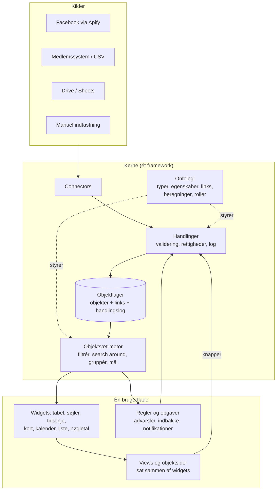

# Arkitektur: fra kort til foreningens operativsystem

Status: **besluttet** – byg selv på Supabase. Fase 1 er i gang (se sidst).

## Kort fortalt

Målet er ét system, hvor alt kan forbindes med alt, hvor brugerne selv kan lave analyser, diagrammer og views, og hvor workflows ligger samme sted som data.

Det løses ikke ved at bygge flere funktioner oven på `app.js`. Det løses ved at lægge en **ontologi** (en typet objektgraf) i bunden, som alt andet bygges på:

> **Objekter** (Forening, Arrangement, Person …) med **egenskaber**, forbundet af **links**, ændret gennem **handlinger** og beriget af **beregninger**. Oven på det: **ét forespørgselssprog** (objektsæt), som alle views, analyser, kortlag, advarsler og workflows bruger.

Det er Palantirs model (Foundry Ontology), skaleret ned til en forening.

## Er det en knowledge graph?

Tæt på, men ikke helt – og forskellen betyder noget for valget af teknologi.

| | Klassisk knowledge graph (RDF, SPARQL, Neo4j) | Ontologi / typet objektgraf (Palantir) |
|---|---|---|
| Skema | Åbent, alt kan siges om alt | Fast, typet: en Forening *har* disse egenskaber |
| Formål | Viden, sammenhænge, slutninger | Drift: se, beslutte, handle |
| Skrivning | Tripler tilføjes | Gennem **handlinger** med regler, rettigheder og log |
| Passer til jer | Nej – for løst og for tungt | **Ja** |

Pointen: I skal have en **graf-formet datamodel**, ikke en **grafdatabase**. Ved jeres datamængde (tiere af foreninger, hundreder af arrangementer, tusinder af medlemmer) er "følg et link" bare et opslag. En almindelig database (Postgres) klarer det uden besvær.

## Hvor systemet er i dag

Prototypen virker og har gode idéer (registre, rettelser som lag oven på kildedata, krypterede admin-filer). Men den er bygget feature for feature:

1. **Logikken er skrevet flere gange.** Momentum og HB-reglerne findes både i `app.js` og i `scripts/hb.py` / `scripts/rapport.py`. De to kopier kan komme ud af trit.
2. **Links er implicitte.** Et arrangement peger på en forening med et navn (`"forening": "Fyn"`). Omdøbes en forening, knækker sammenhængen.
3. **Hver visning har sin egen kode.** Momentum, HB, hvide pletter og "Hvad virker?" har hver deres beregning og tegning. En ny egenskab bliver ikke automatisk tilgængelig i filtre, kort og tabeller.
4. **Udvidelsespunkterne ligger i brugerfladen** (`registerSection`, `registerLayer`). Den nye type data kan ikke registreres, kun nye måder at vise den på.
5. **Adgang er én fælles kode.** Alle admins ser alt. Der er ingen roller og ingen personlig log over, hvem der gjorde hvad.
6. **Git er databasen.** Det fungerer til offentlige arrangementer, men ikke til persondata (se [Persondata](#persondata-vigtigt)).

## Målarkitekturen



### 1. Ontologi – ét skema, der styrer alt

Én deklarativ definition (fx `ontologi/*.ts`) af:

- **Objekttyper og egenskaber:** Forening, Kommune, Arrangement, Person, Rolle (Person er formand i Forening fra–til), Opgave, Note, HB-vurdering, senere Kampagne, Budget …
- **Links:** Arrangement → arrangeret af → Forening (mange-til-mange), Forening → dækker → Kommune, Person → medlem af → Forening, Opgave → handler om → hvad som helst.
- **Beregnede egenskaber (functions):** momentum, HB-status, dage siden sidste arrangement, varsel. De skrives **én gang** i TypeScript og bruges overalt: i filtre, på kortet, i tabeller og i regler. Python-kopierne forsvinder.
- **Roller:** hvem må se og ændre hvilke typer og egenskaber.

Alt, der står i ontologien, dukker automatisk op i analysebyggeren, på kortet, i CSV-eksport og i objektsiderne. Det er det, der gør, at "alt kan forbindes med alt".

### 2. Objektlager med handlingslog

- Hvert objekt har et stabilt id. Links er rigtige referencer, ikke navne.
- **Kildedata og brugerrettelser holdes adskilt.** Det, I allerede gør med `rettelser`, gøres generelt: Facebook siger X, en admin retter til Y, og Y vinder – for alle objekttyper.
- **Alle ændringer er handlinger** i en log, der kun kan skrives til (hvem, hvad, hvornår, hvorfor). Det giver historik, fortryd og "hvad vidste vi den 1. september?" gratis. Månedsrapportens snapshots bliver bare en forespørgsel på loggen.

### 3. Objektsæt – ét forespørgselssprog

Én serialiserbar beskrivelse (JSON), som alle dele af systemet bruger:

```json
{
  "type": "Arrangement",
  "filtre": [
    {"egenskab": "start", "periode": "seneste365"},
    {"egenskab": "arrangeretAf.momentum", "er": ["faldende", "hjaelp"]}
  ],
  "gruppering": {"egenskab": "start", "pr": "maaned"},
  "maal": {"funktion": "median", "egenskab": "deltager"}
}
```

("Median af deltagere pr. måned det seneste år, for arrangementer i foreninger, der mister fart eller har brug for hjælp.")

Den samme beskrivelse kan vises som søjlediagram, tabel eller kort, gemmes som view, bruges som betingelse i en regel ("hvis sættet ikke er tomt, opret en opgave") eller deles som link. Formatet er implementeret i `kerne/objektsaet.js`.

### 4. Widgets og views – brugerne bygger selv

- **Widgets** tager et objektsæt og tegner det: tabel, søjler, tidslinje, kort, kalender, liste, nøgletal, kanban.
- **Views** er gemte sider med widgets, der deler variabler: vælg en forening i kortet, og tabellen og diagrammet ved siden af filtrerer med.
- **Objektsider** genereres ud fra ontologien: foreningspanelet bliver "objektsiden for Forening", konfigureret i stedet for kodet. Samme for Person, Arrangement osv.
- Det offentlige kort er bare et view med den offentlige rolle.

### 5. Workflows – handling samme sted som data

- **Handlinger** er knapper på objekter: "Bekræft afholdt", "Tildel opgave", "Registrér fremmøde". De har regler for, hvem der må, og felter, der skal udfyldes.
- **Regler** er objektsæt med en betingelse og en effekt, der kører på skema eller ved ændringer. "Kræver handling nu" bliver en regel i stedet for hårdkodet logik. Eksempel: "Lokalforeninger uden noget afholdt eller planlagt i kvartalet, 14 dage før kvartalsslut → opret en opgave til regionsansvarlig og send en mail."
- **Opgaver** er selv objekter med links, så de kan ses på kortet, filtreres og analyseres som alt andet.

### 6. Udvidelser på dataniveau

En udvidelse registrerer **objekttyper, beregninger, handlinger, widgets og connectors** mod det samme register. En ny datakilde – fx medlemstal eller kampagner – bliver dermed straks brugbar i alle views og analyser, uden ny UI-kode.

## Teknologivalg (anbefaling)

| Lag | Anbefaling | Hvorfor |
|---|---|---|
| Objektlager, login, rettigheder | **Postgres hos Supabase (EU-region)** | Rigtige personlige logins, rettigheder pr. række (en lokalformand ser kun sin egen forening), handlingslog, gratis til jeres størrelse. Links er bare tabeller – ingen grafdatabase nødvendig. |
| Datamodel i databasen | Generisk: `objekter(id, type, egenskaber jsonb)`, `links(fra, til, type)`, `handlinger(...)` + validering ud fra ontologien | Nye objekttyper kræver ingen databasemigrering. Ved jeres datamængde er ydelsen ikke et problem. |
| Ontologi, beregninger, objektsæt-motor | **JavaScript-moduler med typetjek** (JSDoc + TypeScript), delt mellem browser, Node og server | Én implementering af hver regel. Ingen build-trin: samme filer kører overalt, og der er mindre at vedligeholde. Typetjek og tests i CI fanger fejl tidligt. |
| Analyse | I browseren på det sæt, brugeren har adgang til (evt. DuckDB-WASM senere) | Hurtigt og enkelt ved hundreder–tusinder af objekter. Serveren håndhæver adgangen. |
| Brugerflade | Vite + TypeScript, MapLibre som i dag, lille UI-framework (fx Svelte) | Kan bygges gradvist ved siden af det nuværende. |
| Connectors | De nuværende Python-scripts, men de skriver via handlings-API'et (kilde: "facebook") i stedet for til filer | Genbrug af det, der virker. |
| Hosting | GitHub Pages til frontend som nu; Cloudflare-workeren kan udfases | Ingen ny drift ud over Supabase. |

**Alternativ, der skal nævnes:** NocoDB eller Baserow (open source, kan hostes i EU) giver tabeller, links, views, formularer og automatiseringer færdigt. Kortet og jeres analyser skulle så bygges oven på deres API. Hurtigere start, men mindre kontrol over oplevelsen, og ikke ét samlet interface. Det giver mening, hvis I hellere vil bruge tid på foreningen end på et system.

## Persondata (vigtigt)

Medlemskab af et politisk ungdomsparti afslører politisk overbevisning. Det er **særlige kategorier af personoplysninger** efter GDPR art. 9. Foreningen må godt behandle sine egne medlemmers data (art. 9, stk. 2, litra d), men det stiller krav:

- Persondata må **ikke ligge i git** – heller ikke krypteret. Historikken kan ikke slettes, og alle deler én nøgle.
- Personlige logins, adgang efter rolle og log over, hvem der har set og ændret hvad.
- Databehandleraftale med hostingudbyderen og hosting i EU.

Det er det stærkeste argument for at flytte objektlageret ud af repoet, før personer kommer ind i systemet. (Dette er ikke juridisk rådgivning – tjek med landsorganisationens dataansvarlige.)

## Vej derhen – uden big bang

Hver fase kan tages i brug, før den næste starter.

| Fase | Indhold | Resultat |
|---|---|---|
| **0. Beslut** ✅ | Beslutningerne nedenfor. Skriv ontologien for det, der findes i dag (Forening, Kommune, Arrangement, rettelser, HB, momentum). | Et fælles sprog |
| **1. Kerne i browseren** | Ontologi + objektsæt-motor i TypeScript oven på de nuværende JSON-filer (en adapter). Momentum og HB flyttes ind som beregnede egenskaber. Kort, panel og analysebyggeren bygges om til at bruge motoren. | Én implementering af hver regel. Alle egenskaber virker overalt. Ingen ny server. |
| **2. Rigtigt objektlager** | Supabase, migrering af foreninger, arrangementer og rettelser (rettelser → handlingslog). Personlige logins og roller. Python-sync skriver via API. | Sikker adgang, historik, klar til persondata |
| **3. Views** | Generiske widgets, gemte views med delte variabler, konfigurerbare objektsider. | Brugerne bygger selv |
| **4. Workflows** | Handlinger med formularer, regler på skema/ændring, opgaver og indbakke, mail. | "Kræver handling nu" bliver til opgaver med en ansvarlig |
| **5. Nye objekttyper** | Personer og roller (efter GDPR-afklaring), kampagner, økonomi, frivillige … | Hele foreningen i ét system |

Fase 1 er den vigtigste og kan laves uden at vælge backend. Den giver den grundlæggende struktur, som resten hviler på.

## Beslutninger

1. **Personer (medlemmer, frivillige, bestyrelser) skal ind i systemet.** ✅ Besluttet. En rigtig backend med personlige logins er derfor et krav.
2. **Lokale bestyrelser skal være brugere med adgang til deres egen forening.** ✅ Besluttet. Det kræver **adgang pr. række**: en bestyrelse ser kun sine egne medlemmer. Det bliver det afgørende kriterium i valget nedenfor.
3. **Bygge selv på Supabase.** ✅ Besluttet. Se sammenligningen nedenfor.

### Bygge selv eller købe? (sammenligning, september 2026)

Regnestykket bygger på ca. 23 foreninger × 5 bestyrelsesmedlemmer ≈ 100–120 brugere plus landsledelsen.

| | **Bygge selv på Supabase (Postgres)** | **Baserow** | **NocoDB** |
|---|---|---|---|
| Hvad det er | Database, login og rettigheder som byggeklodser. Brugerfladen bygger I selv. | "Airtable i open source": tabeller, links, views, formularer, automatiseringer, app-bygger. Hollandsk, EU-hosting. | Samme idé som Baserow. Kan også lægges oven på en eksisterende Postgres. |
| Adgang pr. række (bestyrelse ser kun egen forening) | ✅ Indbygget og gratis (Row Level Security) | ⚠️ Rettigheder går kun ned til tabelniveau (Advanced-planen). Omvej: en portal bygget i deres app-bygger (op til 500 app-brugere gratis). | ⚠️ Kun i den dyreste selvbetjente plan (Scale) |
| Pris ved ~120 brugere | ca. 0–175 kr./md. (gratis → Pro $25) | Fulde brugere: $18/bruger/md. → ca. 15.000 kr./md. Billigt kun, hvis bestyrelserne bruger portalen, og få er fulde brugere. | Afhænger af antal redaktører; rækkeadgang kræver Scale |
| Licens | Open source (Apache 2.0); data i almindelig Postgres | Kernen er open source (MIT); rettigheder er betalt | **Ikke længere open source** (Sustainable Use License siden 2026) |
| Kort og ét samlet interface | ✅ Det er det, I bygger | ❌ Kortet og analyserne bliver en separat app oven på deres API | ❌ Samme |
| Tid til noget brugbart | Måneder | Dage–uger | Dage–uger |
| Største risiko | **Nøgleperson-afhængighed:** hvem vedligeholder koden, når du ikke gør? | Pris og begrænsninger låser jer fast; to brugerflader | Licens og pris kan ændre sig igen (er lige sket) |

**Anbefaling: byg selv på Supabase**, men gør det bevidst for at mindske nøgleperson-risikoen:

- Data ligger i **almindelig Postgres** med et dokumenteret skema. Hvis den hjemmebyggede brugerflade en dag står stille, kan et færdigt værktøj sættes oven på de samme data, uden at noget skal flyttes. Vejen tilbage er åben.
- Standardteknologi (TypeScript, Postgres), ingen eksotiske valg, og ontologien som ét dokument, andre kan læse.
- Fase 1 (kernen i browseren) giver værdi, før der er brugt tid på backend.

**Vælg Baserow i stedet**, hvis ingen realistisk kan vedligeholde kode om to år, og I kan leve med, at kortet og analyserne er en separat app. NocoDB anbefales ikke på grund af licensskiftet og prisen på rækkeadgang.

## Status for fase 1

**Gjort:**

- `kerne/`: ontologien (Forening, Arrangement, Kommune, Person, Rolle og links), objektlageret, objektsæt-motoren og reglerne (momentum, HB, status, kategori, dækning, rettelser). Se [kerne/README.md](../kerne/README.md).
- Adapter fra de nuværende JSON-filer (`kerne/kilder/json.js`). Supabase-adapteren i fase 2 skal give samme resultat.
- Adgang pr. type, egenskab og række er en del af modellen (offentlig/forening/admin) og håndhæves i lageret.
- Tests: enhedstests og en **paritetstest**, der kører `app.js` og kernen side om side på seks datoer (inkl. kvartals- og årsskifte) og kræver samme resultat. CI kører dem ved hver pull request.
- Analysebyggeren (`udvidelser/egne-analyser.js`) er bygget om oven på kernen: alle typer, egenskaber og links kommer fra ontologien. Den kan filtrere gennem links, finde objekter, der **ikke** har noget ("lokalforeninger uden arrangementer de næste 30 dage"), og følge links (search around).

**Tilbage i fase 1:**

1. `app.js` skal hente momentum, HB og status fra kernen i stedet for sin egen kopi (paritetstesten gør det sikkert). Derefter fjernes kopien og paritetstesten.
2. Kortets farvninger og foreningspanelet skal bygges på objektsæt.
3. `scripts/hb.py` og `scripts/rapport.py` skal bruge kernen (via Node i GitHub Actions) i stedet for deres egne kopier af reglerne.
4. De øvrige analyser (HB-risiko, hvide pletter, "Hvad virker?", månedsrapport) flyttes over på kernen én ad gangen.
